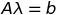

###Method

One fundamental concept of Kriging is spatial auto-correlation: an attribute value can be correlated to itself, with the strength of the correlation depending on separation distance (and possibly direction). The correlation is often expressed as **semi-variance**. Each pair of observation points has a semi-variance, and usually represented as the Greek letter Gamma, and defined as:

where x is a geographic point and z(x) is its attribute value.

The theory of stationary random fields is based on the assumption that absolute location is not important, but only relative location, and the tool for exploring this is the **empirical variogram**, which defined as the average semivariance within some separation range: 

where hij is the distance between points i and j; =h means that this point-pair has the separation vector; h is some small range, the bin.

This spatial dependence is then summarized with a variogram model. From many studies we know that a commom model is the **spherical model**:

where a is the range, separation at which there is no more spatial dependence; c means sill, the maximum semivariance. 

Then the spatial structure can be used to interpolate to un-sampled points by **Ordinary Kriging**. With kriging, the attribute value of any point can be predicted as the weighted average of the values at sampled points, and the weights given to each sample point are optimized by the variogram model. Here is the Ordinary Kriging system in matrix form:

&nbsp;&nbsp;&nbsp;&nbsp;&nbsp;

&nbsp;&nbsp;&nbsp;&nbsp;&nbsp;&nbsp;&nbsp;&nbsp;&nbsp;&nbsp;&nbsp;&nbsp;&nbsp;&nbsp;&nbsp;&nbsp;&nbsp;&nbsp;&nbsp;&nbsp;&nbsp;&nbsp;

where A is the semivariance between all pairs of known points; b is the semivariance for the predication point and all observation points. Then weight vector can be calculated as:

Finally, we can predict at any point using the weights:

###Rent Data

The rent price distribution is highly-skewed, and a common transform is the logarithm. Use base-10 logarithms, and plot the histogram:

Plot the experimental variogram of the log rent concentrations, i.e. the average semi-variances of the point-pairs versus average distance (lag), with a bin width of 100m, to a maximum lag distance of 10000m. Choosing bin width and maximum lag distance is tricky, and there should be more than 30 pairs in each bin.

Fit a spherical variogram model to the experimental variogram of rent price, and then adjust it with automatic fit function.

Predict the rent price at all grid points in Manhattan using Ordinary Kriging, and display the predicted values:

###Sell Data

Same story with sell price. The histogram:

The experimental variogram:

Fit a spherical variogram model to the experimental variogram of sell price:

Predict the sell price at all grid points in Manhattan using Ordinary Kriging, and display the predicted values:

