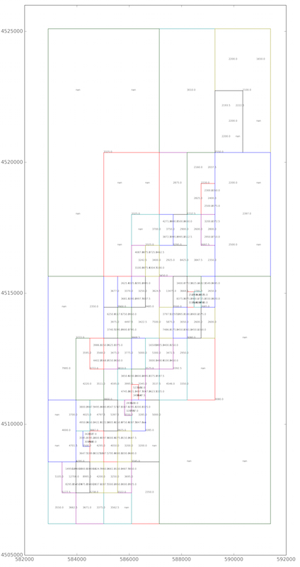
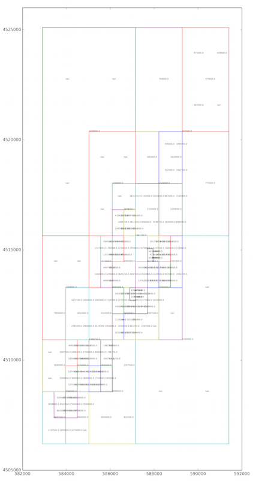

###Method

The idea is derived from Quadtree. Every time we partition a two-dimensional space by recursively subdividing it into four regions. If there's more than 30 points in the region, the recursion continues, and calculate the median value of all the attribute values in this subdivisible region as the predicted value of the region.

###Rent Data

The Manhattan rent price quadtree map.

###Sell Data

The Manhattan sell price quadtree map.

